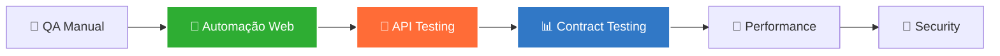

<div align="center">
 
<!-- Banner Animado -->

 
---
 
###  Focado em Automação Web e API com JavaScript e TypeScript
 
[](https://www.linkedin.com/in/joaocmr)
[](https://mail.google.com/mail/?view=cm&fs=1&to=contatojoaocmr@gmail.com)
[](https://github.com/joao-cmr)
 

 
</div>
 
---
 
## João Carlos | QA Engineer Júnior

Atuo no desenvolvimento de estratégias de testes automatizados para garantir a entrega de softwares robustos e livres de falhas. Atualmente, foco em automação E2E e de APIs utilizando o ecossistema JavaScript (Cypress), aplicando metodologias ágeis e práticas de Shift-Left Testing para antecipar a qualidade no ciclo de desenvolvimento. 
 

 
```javascript
const joao = {
  code: ["JavaScript", "Python", "SQL"],
  tools: ["Cypress", "Postman", "Supertest", "K6", "Git"],
  architecture: ["Custom Commands", "App Actions", "Modular Architecture"],
  currentFocus: "Testes de API e Contrato",
  challenge: "Contribuir para produtos de qualidade desde o início"
};
```
 
---
 
##  Stack Técnica
 
### Linguagens & Banco de Dados
 


 
###  QA & Automação
 


### DevOps & Ferramentas
 


 
 
---

##  Atualmente
 
-  Cursando **Análise e Desenvolvimento de Sistemas** (Faculdade Impacta)
-  Desenvolvendo portfólio focado em **Testes de API** e **Contrato**
-  Estudando **Inglês**
-  Aprofundando conhecimentos em **Test Design Patterns**
-  Explorando **AI para QA** (otimização de workflows com LLMs)
 
---
 
 
##  Jornada QA
 

 
**Legenda:**
- ✅ **Concluído** - Automação Web
- 🔄 **Em Progresso** - API Testing & Contract Testing
- 📅 **Próximos Passos** - Performance & Security Testing
 
---
 

 
## Competências QA
 

 
| Categoria | Habilidades |
|-----------|-------------|
| **Test Design** | BDD, TDD, Análise de Requisitos |
| **Automação** | E2E, Integração, Unitário, API |
| **Metodologias** | Scrum, Kanban, Agile Testing |
| **Documentação** | Test Cases, Bug Reports, Test Plans |
| **Ferramentas** | DevTools, Postman, Insomnia, Git |

 

 
---
 
 
 
</div>
 
**Meus Princípios:**
-  **Shift-Left Testing** - Qualidade desde o início
-  **Automação Inteligente** - Automatizar o que faz sentido
-  **Data-Driven** - Decisões baseadas em métricas
-  **Colaboração** - Qualidade é responsabilidade de todos
-  **Melhoria Contínua** - Sempre evoluindo
 
---
 
 
<div align="center">
 
Estou sempre aberto a discutir qualidade de software, automação de testes e novas oportunidades!

## Contatos
 
[](https://www.linkedin.com/in/joaocmr)
[](https://mail.google.com/mail/?view=cm&fs=1&to=contatojoaocmr@gmail.com)
[](https://github.com/joao-cmr)
 
---

<div align="center">
 
 
> *"O planejamento não diz respeito a decisões futuras, mas às implicações futuras de decisões presentes."* — **Peter Drucker**
 
 

 

 
